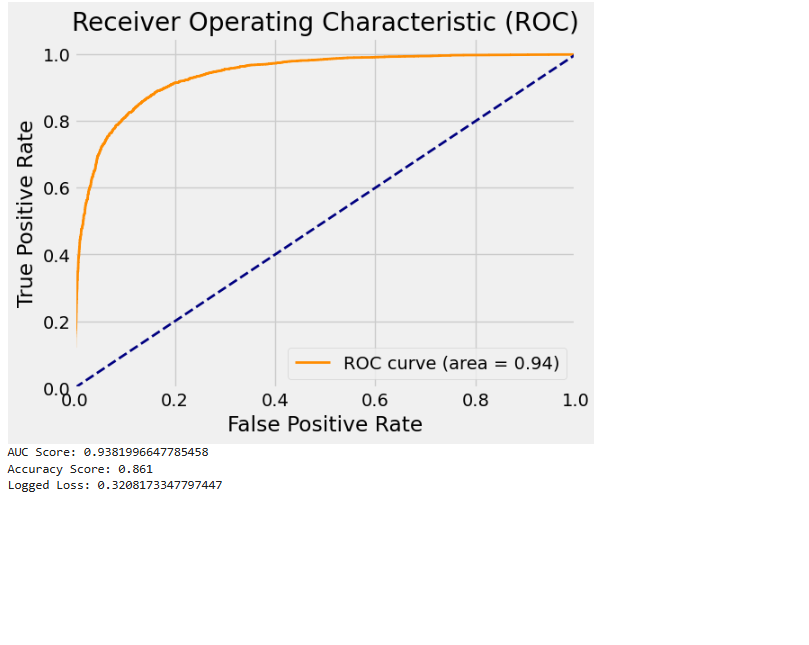

# Transformer_sentiment
Using the powerful transformer model to implement sentiment analysis upon IMDB movie reviews

## Purpose of this project:
1. learn how to build a modulized transformer model from scratch.
2. learn how to adapt transformer modules to a real world use case - sentiment analysis by using custom python code.
3. Practice on some important NLP concepts: tokenization, embedding.
4. Get a deep understanding of how transformer model works by look into the self-attention mechanism.

## The final model performance measurement:
Based on some quick and simple model training (roughly 200 epochs), the model achived AUC 0.94 and accuracy of 86%, indicating the outstanding prediction power of transformer model

## The project codes 1 (transformer modules):
Build standard code modules to implement transformer model efficiently. There are two modules, transformer and stepbystep, under the transformer_modules directory. The first one is a modulized implementation of transformer model, and the second one is for implementing various AI functions such as train, dataloader, predict etc.

p.s. All these modules are inspired by the book <deep learning with pytorch step-by-step>. Based on what's needed, I also added some extra AI functions (early stopping, automatically print losses based on epoch interval etc.) to better implement AI model building. 

## The project codes 2 (the jupyter notebook):
In the main code file - the jupyter notebook (Transformer_Sentiment_dev), I developed custom codes to adapt the transoformer model as a classification model to fulfill the goal of sentiment analysis. This indicates how to adapt the standard code modules to a real world use case.

## Study on self-attention's alpha matrix
In the jupyter notebook, I was able to look into the attention scores derived from the self-attention matrix obtained from the model training process. It is interesting to see how the transformer was able to add more weight on those more relevant texts so eventually being able to deliver solid prediction results.

## background: transformer model
To be added

## background: IMDB dataset
The IMDb (Internet Movie Database) dataset is a widely used benchmark for natural language processing (NLP) tasks, especially sentiment analysis. It consists of 50,000 movie reviews, equally divided into positive and negative sentiments, making it an excellent resource for training and evaluating AI models.

Key Features:
Balanced Dataset: With an equal number of positive and negative reviews, the dataset provides a balanced representation, which is crucial for training models that accurately identify sentiment.

Real-World Text: The reviews come from real users, offering a rich variety of language, slang, and expressions that mirror actual usage patterns.

Versatility: Beyond sentiment analysis, the dataset can support various NLP tasks such as text classification, language modeling, and transfer learning.

